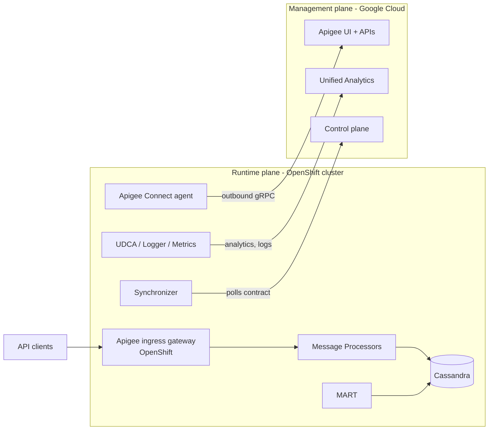

# Apigee Hybrid v1.17.0 on OpenShift — Requirements Document

Sep 24, 2026 · sai Maddula

## Table of contents

- [1. Purpose and scope](#1-purpose-and-scope)
- [2. Big picture](#2-big-picture)
- [3. Supported platforms and versions (v1.17)](#3-supported-platforms-and-versions-v117)
- [4. Prerequisites](#4-prerequisites)
- [5. GCP permissions, APIs and service accounts](#5-gcp-permissions-apis-and-service-accounts)
- [6. OpenShift / Kubernetes permissions and access](#6-openshift--kubernetes-permissions-and-access)
- [7. Plan and prepare – decisions to lock before install](#7-plan-and-prepare--decisions-to-lock-before-install)
- [8. Part 1 – Project and org setup (Google Cloud)](#8-part-1--project-and-org-setup-google-cloud)
- [9. Part 2 – Hybrid runtime setup on OpenShift (11 steps)](#9-part-2--hybrid-runtime-setup-on-openshift-11-steps)
- [10. Part 3 – Expose ingress and test](#10-part-3--expose-ingress-and-test)
- [11. Master requirements checklist](#11-master-requirements-checklist)

## 1. Purpose and scope

This document lists every requirement to install Apigee hybrid **v1.17.0** with the runtime plane on **Red Hat OpenShift (OCP)**, following Google's v1.17 install path: Plan and prepare → Part 1 (Google Cloud and org) → Part 2 (runtime on the cluster, 11 steps) → Part 3 (ingress and test proxy).

**In scope:** Google Cloud project, APIs, Apigee org, environments and environment groups, IAM roles and service accounts, OpenShift cluster sizing, storage, networking, firewall/egress, TLS, cert-manager, CRDs, Helm charts, overrides, ingress exposure and a smoke-test proxy.

**Out of scope:** Day-2 operations (upgrades, backup/restore, multi-region, monetization) except where they drive install-time decisions.

| Item | Value |
| --- | --- |
| Product | Apigee hybrid |
| Version | 1.17.0 (latest at time of writing) |
| Runtime platform | Red Hat OpenShift Container Platform (on-prem / private cloud) |
| Management plane | Google Cloud (Google-managed) |
| Install method | Helm v3 charts (apigeectl is no longer used for install) |
| Primary source | [Apigee hybrid v1.17 – The big picture](https://docs.cloud.google.com/apigee/docs/hybrid/v1.17/big-picture) |

## 2. Big picture

Apigee hybrid splits into a Google-run **management plane** and a customer-run **runtime plane** on OpenShift; all API traffic stays inside your network, while the UI, management APIs and analytics run in Google Cloud.



All runtime-to-Google connections are outbound (HTTPS 443) from the cluster; Google never needs inbound access.

### 2.1 Runtime plane components (run on OpenShift)

| Component | What it does | Install-time requirement |
| --- | --- | --- |
| Message Processor (runtime) | Processes API requests and executes policies; loads proxies, target servers, certs and keystores locally | Stateless node pool (`apigee-runtime`) |
| Synchronizer | Polls the management plane and downloads the environment "contract" (proxies, shared flows, flow hooks, target servers, TLS settings, KVM names, data masks) | Synchronizer access must be enabled for its service account |
| Cassandra | Runtime datastore (StatefulSet) for KMS, KVM, OAuth tokens, quotas, response cache, MART and monetization data | Stateful node pool (`apigee-data`), block storage via StorageClass |
| MART | Management API for Runtime data; handles management calls forwarded from Google to Cassandra | MART service account |
| Apigee Connect agent | Secure outbound gRPC channel so the management plane can reach MART | Apigee Connect API enabled; Connect Agent role |
| UDCA | Uploads analytics and deployment status data to Google | Analytics Agent role |
| Ingress gateway | Exposes Message Processors to clients outside the cluster (Envoy-based Apigee ingress) | TLS cert/key per env group; LoadBalancer/NodePort/Route decision |
| Logger / Metrics (OTel) | Ship logs and metrics to Cloud Logging / Monitoring | Logs Writer, Monitoring Metric Writer roles |
| Watcher | Reports ingress/runtime status to the control plane | Runtime Agent role |
| Apigee operator (controller) | Reconciles Apigee custom resources | CRDs + cluster-scoped RBAC |
| Redis (Apigee datastore) | Distributed cache/quota counters in newer releases | Runs on the runtime pool |

### 2.2 Management plane (Google-managed)

- **Apigee hybrid UI**: build and deploy proxies, products, apps; monitor deployments.
- **Apigee APIs**: programmatic org and environment management.
- **Unified Analytics Platform (UAP)**: receives analytics and deployment status from the runtime.
- **Google Cloud services used**: Identity (Google accounts, service accounts), IAM roles, resource hierarchy (project = Apigee org), Cloud Operations (logging, metrics).
- Optional **data residency**: choose the control-plane region where management data is stored.

### 2.3 Three-part install flow

| Part | Goal | Prerequisites | Done when |
| --- | --- | --- | --- |
| Part 1: Configure Google Cloud and UI | Project and org ready | Google Cloud account and project; gcloud CLI | APIs enabled, org created, environment and environment group created |
| Part 2: Install the runtime | Runtime running on OpenShift | Part 1 done; prerequisites verified | Cluster ready, Helm v3.14.2+ set up, service accounts + auth configured, overrides customized, Synchronizer access set, runtime installed |
| Part 3: Test | Traffic flowing | Overrides configured; runtime installed | Ingress gateway exposed, first proxy created and tested |

Sources: [What is Apigee hybrid? (v1.17)](https://docs.cloud.google.com/apigee/docs/hybrid/v1.17/what-is-hybrid), [The big picture (v1.17)](https://docs.cloud.google.com/apigee/docs/hybrid/v1.17/big-picture)

## 3. Supported platforms and versions (v1.17)

Apigee hybrid 1.17 supports **OpenShift 4.20, 4.21 and 4.22 only**; any OCP 4.19 or older cluster must be upgraded before install. Hybrid is certified on OpenShift using the Kubernetes version bundled with each OCP release.

| Component | Required for hybrid 1.17 | Notes |
| --- | --- | --- |
| OpenShift (OCP) | 4.20, 4.21, 4.22 | Kubernetes version = the one bundled with that OCP release |
| Kubernetes | 1.33.x – 1.36.x |  |
| kubectl / oc | 1.33.x – 1.36.x | `oc` CLI matching the OCP version is also needed |
| Helm | 3.17.0 through 3.x.x | The big-picture page still says 3.14.2+; use ≥ 3.17.0 per the support matrix |
| cert-manager | 1.17.x, 1.18.x, 1.19.x | Recommended: 1.17.2+, 1.18.0+ or 1.19.0+. 1.18 changes the default private-key rotation policy – see Known Issue 465834046 before choosing 1.18/1.19 |
| Cassandra | 4.0 | Bundled in the Apigee charts |
| JDK (runtime) | JDK 17 | New in 1.17 (was JDK 11); re-test custom Java callouts |
| Secret Store CSI driver | 1.4.6+ | Only if using Vault / external secrets |
| HashiCorp Vault | 1.19.0+ | Only if storing secrets in Vault |
| Cloud Service Mesh | 1.22.x | Installed automatically with hybrid; not a separate prerequisite |

**Release and support dates**

| Version | Release date | EOL |
| --- | --- | --- |
| 1.17.0 | 2026-09-14 | Not yet scheduled (minor versions supported max 12 months from release) |
| 1.16 (previous) | 2025-12-19 | Not yet scheduled |

Source: [Apigee hybrid supported platforms and versions](https://docs.cloud.google.com/apigee/docs/hybrid/supported-platforms)

## 4. Prerequisites

Before Part 1, you need an active GCP billing account and project, NTP-synced nodes, an admin workstation with the tools below, and an OpenShift cluster with two labelled node pools and an SSD-backed StorageClass.

### 4.1 Google Cloud and organizational prerequisites

| # | Requirement | Detail |
| --- | --- | --- |
| P-1 | Google Cloud billing account | Active billing linked to the project |
| P-2 | Google Cloud project | New dedicated project for Apigee hybrid (project ID = Apigee org name) |
| P-3 | Apigee entitlement | Subscription (paid) entitlement for hybrid. Pay-as-you-go (PAYG) projects cannot create HYBRID orgs; evaluation orgs expire and are deleted after 60 days; data residency requires SUBSCRIPTION billing |
| P-4 | Clock synchronization | NTP on every node and app server, across all regions (Cassandra relies on timestamps) |
| P-5 | VPC Service Controls (optional) | If VPC-SC is used, follow "Using VPC Service Controls with Apigee and Apigee hybrid" before starting |
| P-6 | Data residency (optional) | Decide control-plane location and consumer data region before creating the org – cannot change later |

### 4.2 Admin workstation software

| Tool | Version | Purpose |
| --- | --- | --- |
| gcloud CLI | Latest (`gcloud components update`) | Provisioning APIs, org, service accounts |
| curl | Any | Calling Apigee management APIs |
| oc CLI | Matches OCP 4.20–4.22 | OpenShift login, SCC, projects |
| kubectl | 1.33.x – 1.36.x | Cluster operations |
| Helm | 3.17.0+ | Installing Apigee charts |
| openssl | Any | Generating TLS certs for ingress |
| jq / yq (recommended) | Any | Scripting and overrides editing |
| Network access from workstation | HTTPS to googleapis.com, us-docker.pkg.dev/gcr.io, quay.io, github.com | Pull charts, images, cert-manager |

### 4.3 Hardware and cluster sizing

| Setting | Stateful pool (`apigee-data`) – Cassandra | Stateless pool (`apigee-runtime`) – everything else |
| --- | --- | --- |
| Nodes | 1 per zone (3 per region) | 1 per zone (3 per region) |
| vCPU per node | 8 prod / 4 non-prod | 8 prod / 4 non-prod |
| RAM per node (GB) | 32 prod / 16 non-prod | 32 prod / 16 non-prod |
| Storage | Dynamic PVs from SSD StorageClass | Managed by ApigeeDeployment CRD (ephemeral) |
| Disk IOPS (min) | 2,000 (SAN or direct-attached; NFS not recommended) | 2,000 |
| Network bandwidth | 1 Gbps per node min | 1 Gbps per node min |

- Production: Google recommends **at least two clusters** (regions) and **three availability zones** per Cassandra cluster.
- Cassandra p99 latency must stay below 100 ms; inter-region traffic on TCP 7001 only, over VPN/private links.
- OpenShift: label worker nodes (e.g. `apigee.com/apigee-nodepool=apigee-data` / `apigee-runtime`), spread evenly across zones, and set `nodeSelector` keys in overrides to match (the GKE default key `cloud.google.com/gke-nodepool` does not exist on OCP).
- Keep `nodeSelector.requiredForScheduling: true` in production so the install fails if pools are missing.

### 4.4 Cassandra production settings (per pod)

| Property | Recommended value |
| --- | --- |
| `cassandra.replicaCount` | 3 (must be a multiple of 3) |
| `cassandra.storage.storageclass` | Your SSD StorageClass (cannot be changed after install) |
| `cassandra.storage.capacity` | 500Gi (default 10Gi is too small) |
| `cassandra.resources.requests.cpu` | 7 |
| `cassandra.resources.requests.memory` | 15Gi |
| `cassandra.maxHeapSize` / `heapNewSize` | 8192M / 1200M |
| Backups | Daily schedule (Cloud Storage or remote server); monitor failures |

### 4.5 Storage requirements

- SSD-backed StorageClass for Cassandra, dynamically provisioned, `allowVolumeExpansion: true`, `volumeBindingMode: WaitForFirstConsumer` recommended.
- **Not supported:** local SSD, NAS/NFS persistent volumes.
- Make it the default StorageClass or set `cassandra.storage.storageclass` explicitly. On OpenShift this is typically ODF (Ceph RBD), vSphere CSI, or a SAN CSI driver.

### 4.6 Ports – internal (inside the cluster)

| Source | Destination | Port | Security |
| --- | --- | --- | --- |
| MART, Message Processor, Synchronizer | Cassandra | TCP 9042, 9142 | mTLS |
| Apigee Connect | MART | TCP 8443 | TLS |
| Ingress gateway | Message Processor | TCP 8443 | TLS (Apigee self-signed) |
| Message Processor | fluentd (analytics/logging) | TCP 20001 | mTLS |
| Cassandra | Cassandra (intra-node) | TCP 7001, 7199 | mTLS |
| Cassandra | Cassandra (inter-region) | TCP 7001 | mTLS |
| Prometheus | Cassandra, UDCA | TCP 7070 | TLS |
| Prometheus | MART, MP, Synchronizer | TCP 8843 | TLS |
| Watcher | Ingress pods | TCP 8843 | TLS |

### 4.7 Ports – external

| Direction | Source → Destination | Port | Purpose |
| --- | --- | --- | --- |
| Inbound | Client apps → Apigee ingress | TCP 443 (configurable) | API traffic |
| Outbound | Message Processor → backends | Any (customer-defined) | Target calls |
| Outbound | Synchronizer → apigee.googleapis.com, iamcredentials.googleapis.com | TCP 443 | Contract download, auth |
| Outbound | UDCA → apigee.googleapis.com, storage.googleapis.com | TCP 443 | Analytics upload |
| Outbound | Apigee Connect → apigeeconnect.googleapis.com | TCP 443 | Management channel (initiated from cluster; no inbound rule needed) |
| Outbound | Metrics → monitoring.googleapis.com | TCP 443 | Cloud Monitoring |
| Outbound | Logger → logging.googleapis.com | TCP 443 | Cloud Logging |
| Outbound | MART → iamcredentials.googleapis.com | TCP 443 | Auth |
| Outbound (optional) | MP → trace backend | http/https | Distributed trace |

Allow by **hostname**, not IP – `*.googleapis.com` IPs change.

### 4.8 Egress allow-list (proxy / firewall)

| URL | Why |
| --- | --- |
| apigee.googleapis.com | Deployments, contract, health reporting |
| apigeeconnect.googleapis.com | MART ↔ control plane |
| iamcredentials.googleapis.com | Access tokens |
| oauth2.googleapis.com | AuthN/AuthZ |
| sts.googleapis.com | Token exchange (Workload Identity Federation) |
| storage.googleapis.com | Proxy bundles, resources, analytics |
| pubsub.googleapis.com | Debug session notifications |
| logging.googleapis.com | Cloud Logging |
| monitoring.googleapis.com | Cloud Monitoring |
| serviceusage.googleapis.com | Quota (service mesh) |
| www.googleapis.com | MART |
| gcr.io (and the Artifact Registry host used by 1.17 images) | Container images – or mirror to a private registry |
| quay.io | cert-manager images |
| binaryauthorization.googleapis.com | Optional, Anthos only |

If data residency is used, also allow the regional endpoint (`CONTROL_PLANE_LOCATION-apigee.googleapis.com`).

Sources: [Prerequisites](https://docs.cloud.google.com/apigee/docs/hybrid/v1.17/prerequisites), [Minimal cluster configurations](https://docs.cloud.google.com/apigee/docs/hybrid/v1.17/cluster-overview), [Configuring dedicated node pools](https://docs.cloud.google.com/apigee/docs/hybrid/v1.17/configure-dedicated-nodes), [Cassandra for production](https://docs.cloud.google.com/apigee/docs/hybrid/v1.17/cassandra-production), [StorageClass configuration](https://docs.cloud.google.com/apigee/docs/hybrid/v1.17/cassandra-config), [Ports and firewalls](https://docs.cloud.google.com/apigee/docs/hybrid/v1.17/ports), [GCP URLs to allow](https://docs.cloud.google.com/apigee/docs/hybrid/v1.17/allow-gcp-urls)

## 5. GCP permissions, APIs and service accounts

The installer needs four human IAM roles (plus Service Usage Admin or Owner to enable APIs), five APIs must be enabled for OpenShift, and production uses one Google service account per Apigee component (8 accounts, 9 with monetization).

### 5.1 IAM roles for the people doing the install

| Task | Role | Role ID |
| --- | --- | --- |
| Enable APIs | Service Usage Admin (or Owner) | `roles/serviceusage.serviceUsageAdmin` (permission `serviceusage.services.enable`) |
| Create the Apigee org, environments, env groups | Apigee Organization Admin | `roles/apigee.admin` |
| Create service accounts | Create Service Accounts | `roles/iam.serviceAccountCreator` |
| Grant roles to service accounts in the project | Project IAM Admin | `roles/resourcemanager.projectIamAdmin` |
| Grant Synchronizer access | Apigee Organization Admin | `roles/apigee.admin` |
| Download SA keys (if using JSON keys / K8s secrets / Vault) | Service Account Key Admin | `roles/iam.serviceAccountKeyAdmin` (verify org policy allows key creation) |
| Workload Identity Federation on OpenShift (optional) | Workload Identity Pool Admin + Service Account Admin | `roles/iam.workloadIdentityPoolAdmin`, `roles/iam.serviceAccountAdmin` |
| Day-to-day admin in Apigee UI (post-install) | Apigee roles as needed | e.g. `roles/apigee.admin`, `roles/apigee.environmentAdmin`, `roles/apigee.apiAdminV2`, `roles/apigee.developerAdmin`, `roles/apigee.analyticsViewer` |

The GKE-only roles on the permissions page (Kubernetes Engine Admin, Service Account Admin for Workload Identity for GKE) are **not needed** on OpenShift.

### 5.2 Google Cloud APIs to enable (OpenShift)

| API | Title | Why |
| --- | --- | --- |
| apigee.googleapis.com | Apigee API | Project ↔ hybrid services |
| apigeeconnect.googleapis.com | Apigee Connect API | Management plane ↔ runtime (MART) |
| monitoring.googleapis.com | Cloud Monitoring API | Metrics |
| pubsub.googleapis.com | Cloud Pub/Sub API | Quota feature, debug sessions |
| cloudresourcemanager.googleapis.com | Cloud Resource Manager API | Service account validation |

```bash
gcloud services enable \
  apigee.googleapis.com apigeeconnect.googleapis.com \
  cloudresourcemanager.googleapis.com monitoring.googleapis.com \
  pubsub.googleapis.com --project $PROJECT_ID
```

Recommended additionally: `logging.googleapis.com` (Cloud Logging), `iam.googleapis.com` / `iamcredentials.googleapis.com` and `sts.googleapis.com` if you use Workload Identity Federation.

### 5.3 Service accounts and IAM roles (production)

| Service account | IAM role(s) | Helm chart |
| --- | --- | --- |
| apigee-cassandra | Storage Object Admin | apigee-datastore |
| apigee-guardrails | Service Usage Viewer | apigee-operator |
| apigee-logger | Logs Writer | apigee-telemetry |
| apigee-mart | Apigee Connect Agent | apigee-org |
| apigee-metrics | Monitoring Metric Writer | apigee-telemetry |
| apigee-mint-task-scheduler | None (only if Monetization is used) | apigee-org |
| apigee-runtime | None | apigee-env |
| apigee-synchronizer | Apigee Synchronizer Manager, Storage Object Admin | apigee-env |
| apigee-watcher | Apigee Runtime Agent | apigee-org |

**Non-prod:** one account `apigee-non-prod` with all of: Storage Object Admin, Service Usage Viewer, Logs Writer, Apigee Connect Agent, Monitoring Metric Writer, Apigee Synchronizer Manager, Apigee Runtime Agent – used by all charts.

Create them with the bundled tool: `$APIGEE_HELM_CHARTS_HOME/apigee-operator/etc/tools/create-service-account --prod --dir <dir>` (flags: `--non-prod`, `--project-id`, `--skip-key-download`, `--name`).

### 5.4 Service account authentication method (choose one)

| Method | Fits OpenShift? | Notes |
| --- | --- | --- |
| Kubernetes Secrets (JSON keys stored as secrets) | Yes – most common | Needs SA key creation allowed by org policy |
| JSON key files in chart directories | Yes | Simplest; keys live on the admin machine |
| HashiCorp Vault | Yes | SELECTED for this install. Vault 1.19.0+, Secrets Store CSI driver 1.4.6+ + Vault CSI provider (see 5.5) |
| Workload Identity Federation for GKE | No | GKE only |
| Workload Identity Federation on other platforms | Possible | Keyless; needs an OIDC issuer reachable by Google STS and a workload identity pool/provider |

### 5.5 Vault requirements (selected method)

Service account keys are stored in HashiCorp Vault and mounted into Apigee pods by the Secrets Store CSI driver; no SA keys are stored as Kubernetes Secrets.

| # | Requirement | Detail |
| --- | --- | --- |
| V-1 | Vault server | 1.19.0+, reachable from the cluster (in-cluster address typically `http://vault.<ns>.svc.cluster.local:<port>`); TLS recommended |
| V-2 | Secrets Store CSI driver | 1.4.6+, installed with Helm, plus the **Vault CSI provider** |
| V-3 | Vault Kubernetes auth method | Enabled and configured against the OpenShift API server (`auth/kubernetes`) |
| V-4 | Org secret | `secret/data/apigee/orgsakeys` with keys: cassandraBackup, cassandraRestore, connectAgent, guardrails, logger, mart, metrics, watcher (+ mint if Monetization). Values = SA JSON key contents; backup and restore both use the apigee-cassandra key |
| V-5 | Env secrets (one per env) | `secret/data/apigee/envsakeys-<ENV_NAME>` with keys: runtime, synchronizer |
| V-6 | Vault policies | `apigee-orgsakeys-auth` (read on org path); `apigee-envsakeys-<ENV_NAME>-auth` (read on each env path) |
| V-7 | Vault roles | `auth/kubernetes/role/apigee-orgsakeys` and `apigee-envsakeys-<ENV_NAME>`, bound to the Apigee Kubernetes SA names (generated with Google's `generate-encoded-sas.sh`) in namespace `apigee`, `ttl=1m` |
| V-8 | SecretProviderClass objects | `apigee-orgsakeys-spc` (org) and `apigee-envsakeys-<ENV_NAME>-spc` (per env) in `apigee`; `objectName` values must match exactly (cassandraBackup, cassandraRestore, guardrails, connectAgent, logger, mart, metrics, mint, watcher, runtime, synchronizer) |
| V-9 | Overrides | Top-level `serviceAccountSecretProviderClass: apigee-orgsakeys-spc`; per env `envs[].serviceAccountSecretProviderClass: apigee-envsakeys-<ENV_NAME>-spc` |
| V-10 | OpenShift access | CSI driver and Vault provider DaemonSets run privileged (hostPath mounts) – needs cluster-admin and a privileged SCC for their service accounts; Vault Agent/provider must be able to reach the Vault address |
| V-11 | Key handling | Create SA keys (`create-service-account --prod --dir ...`), load them into Vault, then delete the local JSON files |

Sources: [Step 5: Set up service account authentication (Vault tab)](https://docs.cloud.google.com/apigee/docs/hybrid/v1.17/install-sa-authentication), [Storing service account keys in Hashicorp Vault](https://docs.cloud.google.com/apigee/docs/hybrid/v1.17/storing-sa-keys-in-vault)

Sources: [Permissions and roles](https://docs.cloud.google.com/apigee/docs/hybrid/v1.17/precog-permissions), [Step 1: Enable APIs](https://docs.cloud.google.com/apigee/docs/hybrid/v1.17/precog-enableapi), [Step 4: Set up service accounts](https://docs.cloud.google.com/apigee/docs/hybrid/v1.17/install-service-accounts)

## 6. OpenShift / Kubernetes permissions and access

The simplest path is to install as an OpenShift `cluster-admin`; if install is delegated, the installer needs create/update/patch/delete on cluster-scoped RBAC, webhooks, CRDs, cert-manager issuers and OpenShift **SecurityContextConstraints (SCC)**.

### 6.1 Cluster-scoped resources the installer must manage

| API group / resource | Why Apigee needs it | Scope |
| --- | --- | --- |
| CustomResourceDefinition | Apigee CRDs (step 10) + cert-manager CRDs (step 9) | Cluster |
| ClusterRole, ClusterRoleBinding | Apigee operator, istiod/ingress manager | Cluster |
| MutatingWebhookConfiguration, ValidatingWebhookConfiguration | Apigee operator and cert-manager webhooks | Cluster |
| ClusterIssuer (cert-manager) | Apigee CA issuer for internal mTLS | Cluster |
| SecurityContextConstraints | **OpenShift only** – allow Apigee pods' security contexts | Cluster |
| StorageClass | Only if not using the default SSD StorageClass | Cluster |
| PriorityClass | Listed on the permissions page (required for apigeectl only) | Cluster |
| Namespace | Create `apigee` (and `cert-manager`) | Cluster |

### 6.2 Namespaced resources (in `apigee` namespace)

ServiceAccount, Role, RoleBinding, Secret, ConfigMap, Deployment, StatefulSet, Job, CronJob, Service, PersistentVolumeClaim, Issuer, Certificate, plus all Apigee custom resources.

### 6.3 Apigee custom resources created by the charts

| CRD | Purpose |
| --- | --- |
| ApigeeDatastore | Cassandra StatefulSet |
| ApigeeDeployment | Runtime components (MP, etc.) |
| ApigeeOrganization | Org-level components (MART, Connect, watcher, UDCA) |
| ApigeeEnvironment | Per-environment runtime + synchronizer |
| ApigeeRedis | Redis for distributed rate-limit counts (SpikeArrest UseEffectiveCount) |
| ApigeeRoute / ApigeeRouteConfig | Ingress routing per env group |
| ApigeeTelemetry | Logs and metrics collection |
| ApigeeIssues | Automated issue surfacing |
| CassandraDataReplication | Multi-region Cassandra replication |
| SecretRotation | Credential rotation |

### 6.4 OpenShift-specific access requirements

| # | Requirement | Owner |
| --- | --- | --- |
| O-1 | `cluster-admin` (or equivalent custom ClusterRole covering 6.1) for steps 3, 9, 10, 11 ("elevated cluster permissions") | OpenShift platform team |
| O-2 | `oc` CLI logged in; kubeconfig context pointing to the target cluster | Installer |
| O-3 | SCC for Apigee service accounts (Cassandra, runtime, ingress, telemetry) – validate with a dry run; grant `anyuid`/custom SCC only if pods are rejected by `restricted-v2` | OpenShift platform + security team |
| O-4 | Worker nodes labelled for `apigee-data` / `apigee-runtime` (MachineSets or manual `oc label node`) | OpenShift platform team |
| O-5 | SSD StorageClass with dynamic provisioning available to the `apigee` namespace | Storage team |
| O-6 | LoadBalancer capability (MetalLB, cloud LB, F5, etc.) or agreed NodePort/Route passthrough for the ingress service | Network team |
| O-7 | Egress proxy / firewall rules for the URLs in 4.8 (cluster-wide proxy in `proxy/cluster` if used) | Network team |
| O-8 | Pull access to gcr.io / us-docker.pkg.dev / quay.io, or a mirrored private registry + pull secret | Platform team |
| O-9 | Resource quotas / LimitRanges on `apigee` namespace sized to at least the node-pool minimums | Platform team |
| O-10 | NetworkPolicies (if enforced) allow the internal ports in 4.6 | Network / security team |

### 6.5 Recommended OpenShift RBAC split

- **Platform admin** (cluster-admin): cert-manager, CRDs, apigee-operator chart, SCCs, StorageClass, node labels.
- **Apigee installer** (namespace admin on `apigee` + read on cluster CRDs): datastore, telemetry, redis, ingress-manager, org, env and virtualhost charts, secrets.
- **Apigee operations** (view/edit on `apigee`): day-2 troubleshooting, logs, scaling.

Sources: [Permissions and roles](https://docs.cloud.google.com/apigee/docs/hybrid/v1.17/precog-permissions), [Kubernetes and custom resources used by Apigee](https://docs.cloud.google.com/apigee/docs/hybrid/kubernetes-resources), [Part 2: Before you begin](https://docs.cloud.google.com/apigee/docs/hybrid/v1.17/install-before-begin)

## 7. Plan and prepare – decisions to lock before install

Fifteen decisions must be made before Part 1; several (org name, data residency, StorageClass, analytics region) cannot be changed afterwards.

| # | Decision | Options | Changeable later? | Value (fill in) |
| --- | --- | --- | --- | --- |
| D-1 | Installation type | Production (SA per component, 3+ Cassandra replicas) / Non-prod (single SA, 1 replica) | Rebuild required |  |
| D-2 | GCP project ID = Apigee org name | Lowercase, digits, hyphens, max 32 chars; one org per project | No |  |
| D-3 | Data residency | None (set `ANALYTICS_REGION`) / Data residency (`CONTROL_PLANE_LOCATION` + `CONSUMER_DATA_REGION`, SUBSCRIPTION billing) | No |  |
| D-4 | Analytics region | Any supported Apigee analytics region | No |  |
| D-5 | Environments | Names (2–32 chars, lowercase, start with letter), deployment type (proxy vs. archive) | Deployment type: No |  |
| D-6 | Environment groups + hostnames | e.g. `api.example.com`; hostnames unique per group | Yes |  |
| D-7 | Service account auth method | K8s Secrets / JSON files / Vault / WIF on other platforms | Migration effort | HashiCorp Vault (decided) |
| D-8 | Kubernetes namespace | `apigee` (default) or custom (must also edit CRD kustomization) | Rebuild |  |
| D-9 | `instanceID` | Up to 63 alphanumerics; same for all orgs in the same cluster | No |  |
| D-10 | Cluster topology | Single region / multi-region (separate cluster per region; `cassandra.hostNetwork: true` for OpenShift multi-region without pod-to-pod connectivity) | Expandable |  |
| D-11 | Cassandra StorageClass + size | SSD class; 500Gi+/pod for prod | Class: No; size: expand only |  |
| D-12 | Ingress exposure | Custom K8s Service (recommended) type LoadBalancer / NodePort behind F5/HAProxy; ingress name max 17 chars | Yes |  |
| D-13 | TLS for env-group hostnames | CA-signed cert/key (prod) or self-signed (quickstart) | Yes |  |
| D-14 | Image source | Public gcr.io / Artifact Registry, or private mirror via `apigee-pull-push.sh` | Yes |  |
| D-15 | Optional features | Monetization (extra SA + analytics publisher), enhanced per-env proxy limits (`enhanceProxyLimits: true`), large payloads (>10 MB), VPC-SC | Mostly yes |  |

### 7.1 Readiness checklist (Plan and prepare)

- [ ] OCP version is 4.20, 4.21 or 4.22
- [ ] Admin workstation has gcloud, oc, kubectl 1.33–1.36, Helm ≥ 3.17, openssl, curl
- [ ] NTP verified on all nodes
- [ ] Node pools sized and labelled (3 data + 3 runtime nodes minimum for prod, spread over 3 zones)
- [ ] SSD StorageClass tested (≥ 2,000 IOPS, not NFS/NAS)
- [ ] Egress to all URLs in 4.8 tested from the cluster (`curl -v https://apigee.googleapis.com`)
- [ ] Load balancer / VIP and DNS records reserved for each env-group hostname
- [ ] CA-signed TLS certs obtained for each env-group hostname
- [ ] GCP IAM roles (section 5.1) granted to installer accounts
- [ ] Org policy allows service-account key creation (if using keys)
- [ ] OpenShift cluster-admin (or delegated RBAC in 6.1) available for the install window
- [ ] Backup target (GCS bucket or remote server) identified for Cassandra

Sources: [Step 2: Create an organization](https://docs.cloud.google.com/apigee/docs/hybrid/v1.17/precog-provision), [Step 3: Create environment group](https://docs.cloud.google.com/apigee/docs/hybrid/v1.17/precog-add-environment), [Step 7: Create the overrides](https://docs.cloud.google.com/apigee/docs/hybrid/v1.17/install-create-overrides)

## 8. Part 1 – Project and org setup (Google Cloud)

Part 1 enables five APIs, creates one HYBRID Apigee org bound to the project, and creates at least one environment and one environment group with a hostname.

| Step | Action | Command / API | Required role | Output / verification |
| --- | --- | --- | --- | --- |
| Prereq | Project, billing, gcloud installed | `gcloud components update` | Project Owner/creator | `gcloud --help` works |
| 1 | Enable APIs (OpenShift list) | `gcloud services enable apigee.googleapis.com apigeeconnect.googleapis.com cloudresourcemanager.googleapis.com monitoring.googleapis.com pubsub.googleapis.com --project $PROJECT_ID` | Service Usage Admin / Owner | `gcloud services list` shows all 5 |
| 2 | Create org (`ORG_NAME=$PROJECT_ID`, `RUNTIMETYPE=HYBRID`, `ANALYTICS_REGION`) | `POST https://apigee.googleapis.com/v1/organizations?parent=projects/$PROJECT_ID` (data residency: `https://$CONTROL_PLANE_LOCATION-apigee.googleapis.com/...` with `billingType: SUBSCRIPTION`, `apiConsumerDataLocation`) | Apigee Organization Admin | Long-running operation `state: FINISHED`; org `state: ACTIVE` |
| 3a | Create environment | UI: Management > Environments, or `POST .../organizations/$ORG_NAME/environments` | Apigee Organization Admin | `GET .../environments` lists it (up to 5 min) |
| 3b | Create environment group with hostname(s) | `POST .../organizations/$ORG_NAME/envgroups` `{name, hostnames:[$DOMAIN]}` | Apigee Organization Admin | `GET .../envgroups` shows `ACTIVE` |
| 3c | Attach environment to group | `POST .../envgroups/$ENV_GROUP/attachments` `{environment}` | Apigee Organization Admin | Attachment returns a unique name hash |

**Environment variables to record:** `PROJECT_ID`, `ORG_NAME`, `ANALYTICS_REGION` (or `CONTROL_PLANE_LOCATION`, `CONSUMER_DATA_REGION`), `ENV_NAME`, `ENV_GROUP`, `DOMAIN`, `TOKEN=$(gcloud auth print-access-token)`.

**Common Part 1 errors:** 400 "Does not have an Apigee entitlement" (project not hybrid-enabled), 400 "runtimeType HYBRID is not supported for PAYG\_V2" (PAYG project), 409 "Organization already exists" (one org per project), 409 "Org already exists" (name taken globally).

Sources: [Part 1 overview](https://docs.cloud.google.com/apigee/docs/hybrid/v1.17/precog-overview), [Enable APIs](https://docs.cloud.google.com/apigee/docs/hybrid/v1.17/precog-enableapi), [Create an organization](https://docs.cloud.google.com/apigee/docs/hybrid/v1.17/precog-provision), [Create an environment group](https://docs.cloud.google.com/apigee/docs/hybrid/v1.17/precog-add-environment)

## 9. Part 2 – Hybrid runtime setup on OpenShift (11 steps)

Part 2 installs cert-manager, the Apigee CRDs and eight Helm charts (1.17.0) into the `apigee` namespace in a fixed order; steps 3, 9, 10 and the operator chart need elevated cluster permissions.

| Step | What | Key command / artifact | Needs | Verify |
| --- | --- | --- | --- | --- |
| 1 | Create / prepare OCP cluster | OCP 4.20–4.22, `oc` CLI, NTP, 2 labelled pools, SSD StorageClass | Platform team | `oc get nodes --show-labels`, `oc get sc` |
| 2 | Download Helm charts | `CHART_REPO=oci://us-docker.pkg.dev/apigee-release/apigee-hybrid-helm-charts`, `CHART_VERSION=1.17.0`, `helm pull $CHART_REPO/<chart> --version $CHART_VERSION --untar` for: apigee-operator, apigee-datastore, apigee-env, apigee-ingress-manager, apigee-org, apigee-redis, apigee-telemetry, apigee-virtualhost | Internet to us-docker.pkg.dev | 8 chart folders under `$APIGEE_HELM_CHARTS_HOME` |
| 3 | Create namespace | `kubectl create namespace apigee` (or `oc new-project apigee`) | Namespace create | `kubectl get ns apigee` |
| 4 | Create Google service accounts | `apigee-operator/etc/tools/create-service-account --prod --dir ...` (see 5.3) | Create SA + Project IAM Admin | `gcloud iam service-accounts list` |
| 5 | Service account authentication (Vault) | Install Secrets Store CSI driver + Vault provider; write `orgsakeys` and `envsakeys-<ENV>` secrets; create policies and Kubernetes-auth roles; `kubectl -n apigee apply -f spc-org.yaml` and `spc-env-<ENV>.yaml` (see 5.5) | Vault admin, cluster-admin (CSI driver) | `kubectl get secretproviderclass -n apigee` shows org + env SPCs |
| 6 | Create TLS certs for ingress | Place `keystore_$ENV_GROUP.pem` + `.key` in `apigee-virtualhost/certs/` (self-signed via `openssl req -x509 ... -subj '/CN='$DOMAIN` for quickstart; CA-signed for prod) | Certs per env group | Files present |
| 7 | Create `overrides.yaml` | See minimum properties table below; keep in version control | All decisions in section 7 | `helm ... --dry-run=server` passes |
| 8 | Enable control-plane access | `PATCH .../organizations/$ORG_NAME/controlPlaneAccess?update_mask=synchronizer_identities` (apigee-synchronizer SA) and `?update_mask=analytics_publisher_identities` (apigee-mart, apigee-runtime, + mint) | `roles/apigee.admin` | `GET .../controlPlaneAccess` lists identities |
| 9 | Install cert-manager | OpenShift: follow cert-manager docs (or `kubectl apply -f https://github.com/cert-manager/cert-manager/releases/download/v1.19.2/cert-manager.yaml`); use 1.17.2+, 1.18.0+ or 1.19.0+ | cluster-admin, quay.io access | cert-manager, cainjector, webhook pods Running |
| 10 | Install Apigee CRDs | `kubectl apply -k apigee-operator/etc/crds/default/ --server-side --force-conflicts --validate=false` (dry-run first; edit kustomization namespace if not `apigee`) | cluster-admin | `kubectl get crds \| grep apigee` shows 11 CRDs |
| 11 | Install charts with Helm (in order) | See order table below; each `helm upgrade <release> <chart>/ --install -n apigee --atomic -f overrides.yaml` (dry-run first) | Operator: cluster-admin; rest: namespace admin | Each CR reaches `running` |

### 9.1 Helm install order (step 11)

| # | Release | Chart | Verify |
| --- | --- | --- | --- |
| 1 | operator | apigee-operator | `kubectl -n apigee get deploy apigee-controller-manager` 1/1 |
| 2 | datastore | apigee-datastore | `kubectl -n apigee get apigeedatastore default` = running |
| 3 | telemetry | apigee-telemetry | `get apigeetelemetry apigee-telemetry` = running |
| 4 | redis | apigee-redis | `get apigeeredis default` = running |
| 5 | ingress-manager | apigee-ingress-manager | `get deployment apigee-ingressgateway-manager` ready |
| 6 | $ORG\_NAME | apigee-org | `get apigeeorg` = running |
| 7 | ENV\_RELEASE\_NAME (per env) | apigee-env `--set env=$ENV_NAME` | `get apigeeenv` = running |
| 8 | ENV\_GROUP\_RELEASE\_NAME (per env group) | apigee-virtualhost `--set envgroup=$ENV_GROUP` | `get arc` and `get ar` show route configs |

### 9.2 Minimum `overrides.yaml` properties

| Property | Value / example |
| --- | --- |
| `instanceID` | Unique, ≤ 63 chars |
| `namespace` | `apigee` |
| `gcp.projectID`, `gcp.region` | Project ID, analytics region |
| `k8sCluster.name`, `k8sCluster.region` | Cluster name, closest Google Cloud region |
| `org` | ORG\_NAME |
| `enhanceProxyLimits` | `true` (enhanced per-environment proxy limits) |
| `contractProvider` | Only with data residency: `https://CONTROL_PLANE_LOCATION-apigee.googleapis.com` |
| `serviceAccountSecretProviderClass`, `envs[].name`, `envs[].serviceAccountSecretProviderClass` | `apigee-orgsakeys-spc` (org); `apigee-envsakeys-<ENV_NAME>-spc` per environment |
| `cassandra.hostNetwork` | `false` single region; `true` for OpenShift multi-region without pod-to-pod connectivity |
| `cassandra.replicaCount`, `storage.storageSize`, `resources`, `maxHeapSize`, `heapNewSize` | 3 / 500Gi / 7 CPU, 15Gi / 8192M / 1200M (prod) |
| `cassandra.storage.storageclass` | SSD class name if not default |
| `ingressGateways[].name`, `replicaCountMin/Max`, `svcType`, `svcAnnotations` | Name ≤ 17 chars; 2 / 10 |
| `virtualhosts[].name`, `selector`, `sslCertPath`, `sslKeyPath` (or `sslSecret`) | One per env group |
| `guardrails`, `mart`, `connectAgent`, `logger`, `metrics`, `watcher` service account settings | Not set per component with Vault – keys come from the org SecretProviderClass |
| `nodeSelector.requiredForScheduling`, `apigeeData`, `apigeeRuntime` keys/values | Match OpenShift node labels |
| Optional | `mintTaskScheduler`, `runtime.image`, large payload `runtime.cwcAppend`, private registry image URLs, `certManager.namespace` |

Sources: [Part 2: Before you begin](https://docs.cloud.google.com/apigee/docs/hybrid/v1.17/install-before-begin), [Step 1: Create a cluster](https://docs.cloud.google.com/apigee/docs/hybrid/v1.17/install-create-cluster), [Step 2: Download charts](https://docs.cloud.google.com/apigee/docs/hybrid/v1.17/install-download-charts), [Step 3: Namespace](https://docs.cloud.google.com/apigee/docs/hybrid/v1.17/install-create-namespace), [Step 5: SA authentication](https://docs.cloud.google.com/apigee/docs/hybrid/v1.17/install-sa-authentication), [Step 6: TLS](https://docs.cloud.google.com/apigee/docs/hybrid/v1.17/install-create-tls-certificates), [Step 7: Overrides](https://docs.cloud.google.com/apigee/docs/hybrid/v1.17/install-create-overrides), [Step 8: Control plane access](https://docs.cloud.google.com/apigee/docs/hybrid/v1.17/install-enable-control-plane-access), [Step 9: cert-manager](https://docs.cloud.google.com/apigee/docs/hybrid/v1.17/install-cert-manager), [Step 10: CRDs](https://docs.cloud.google.com/apigee/docs/hybrid/v1.17/install-crds), [Step 11: Helm](https://docs.cloud.google.com/apigee/docs/hybrid/v1.17/install-helm-charts)

## 10. Part 3 – Expose ingress and test

Part 3 is done when `/healthz/ingress` returns "Apigee Ingress is healthy" and a test proxy (`/myproxy` → mocktarget.apigee.net) returns HTTP 200 "Hello, Guest!" through the env-group hostname.

### 10.1 Step 1 – Expose the Apigee ingress gateway

- On OpenShift, create a **custom Kubernetes Service** per ingress gateway (recommended; Apigee does not support all customizations of the default service, and a custom service keeps its IP across reinstalls).
- Selector labels (required): `app: apigee-ingressgateway`, `ingress_name: <INGRESS_NAME>`, `org: <ORG_NAME>`.
- Ports: `443 → targetPort 8443` (runtime traffic) and `15021` (status-port, `/healthz/ready`).
- `type: LoadBalancer` needs an LB provider on OCP (MetalLB, cloud LB); otherwise use NodePort behind an external LB (F5/HAProxy) with TLS passthrough. Plain OpenShift Routes would need **passthrough** termination because Apigee terminates TLS itself.
- Then set `ingressGateways[].svcType: ClusterIP` and re-run `helm upgrade $ORG_NAME apigee-org/ ...` to disable the default LB service.
- Health check: `curl -H 'User-Agent: GoogleHC' https://$DOMAIN/healthz/ingress -k --resolve "$DOMAIN:443:$INGRESS_IP"` → "Apigee Ingress is healthy".
- Create DNS A/CNAME records for each env-group hostname pointing to the LB IP/VIP.

### 10.2 Step 2 – Deploy and call a test proxy

1. Apigee UI → Proxy development → API proxies → Create → Reverse proxy.
2. Name `myproxy`, base path `/myproxy`, target `https://mocktarget.apigee.net` (requires MP egress to the internet, or use an internal backend instead).
3. Deploy to the environment attached to your env group; wait for green status.
4. Call: `curl -H Host:$DOMAIN --resolve $DOMAIN:443:$INGRESS_IP https://$DOMAIN/myproxy -k -v` → `HTTP 200`, `Hello, Guest!`.

### 10.3 Post-install validation checklist

- [ ] All pods Running in `apigee` and `cert-manager`: `kubectl get pods -n apigee`
- [ ] `apigeedatastore`, `apigeetelemetry`, `apigeeredis`, `apigeeorg`, `apigeeenv` all `running`
- [ ] Synchronizer logs show contract download; no 403 from `controlPlaneAccess`
- [ ] Analytics visible in Apigee UI within \~10 minutes of test traffic
- [ ] Logs in Cloud Logging and metrics in Cloud Monitoring for the project
- [ ] Debug session works (needs pubsub.googleapis.com egress)
- [ ] Cassandra backup job scheduled and first backup succeeds
- [ ] `overrides.yaml`, certs and chart versions committed to source control (no SA keys in git)

Sources: [Step 1: Expose Apigee ingress](https://docs.cloud.google.com/apigee/docs/hybrid/v1.17/install-expose-apigee-ingress), [Step 2: Deploy an API proxy](https://docs.cloud.google.com/apigee/docs/hybrid/v1.17/install-deploy-proxy)

## 11. Master requirements checklist

Every requirement below must be met (or explicitly waived) before the install window; owners are suggested teams to confirm.

| ID | Requirement | Category | Owner | Done |
| --- | --- | --- | --- | --- |
| R-01 | GCP billing account + dedicated project | GCP | Cloud team | \[ \] |
| R-02 | Apigee hybrid subscription entitlement on the project | GCP / Licensing | Google account team | \[ \] |
| R-03 | Installer has Service Usage Admin, Apigee Org Admin, SA Creator, Project IAM Admin | GCP IAM | Cloud IAM team | \[ \] |
| R-04 | 5 APIs enabled (Apigee, Apigee Connect, Monitoring, Pub/Sub, Resource Manager) | GCP | Installer | \[ \] |
| R-05 | Apigee org (HYBRID) created; analytics region / data residency chosen | GCP | Installer | \[ \] |
| R-06 | Environment(s) + environment group(s) + hostnames created and attached | GCP | Installer | \[ \] |
| R-07 | 8 production service accounts (+ mint) with roles in 5.3 | GCP IAM | Installer | \[ \] |
| R-08 | Vault 1.19.0+, Secrets Store CSI driver 1.4.6+ and Vault provider ready; SA keys loaded to Vault; SecretProviderClasses created (5.5) | Security | Security team | \[ \] |
| R-09 | Synchronizer + analytics publisher identities set via controlPlaneAccess | GCP | Installer | \[ \] |
| R-10 | OpenShift 4.20 / 4.21 / 4.22 cluster | OpenShift | Platform team | \[ \] |
| R-11 | 3+ `apigee-data` and 3+ `apigee-runtime` nodes (8 vCPU / 32 GB prod) across 3 zones, labelled | OpenShift | Platform team | \[ \] |
| R-12 | SSD StorageClass, dynamic provisioning, ≥ 2,000 IOPS, 500Gi+/Cassandra pod | Storage | Storage team | \[ \] |
| R-13 | NTP synchronized on all nodes (and across regions) | Infra | Platform team | \[ \] |
| R-14 | cluster-admin (or delegated RBAC incl. SCC, CRD, webhooks, ClusterIssuer) | OpenShift RBAC | Platform team | \[ \] |
| R-15 | SCC strategy validated for Apigee pods | OpenShift security | Security team | \[ \] |
| R-16 | Admin workstation: gcloud, oc, kubectl 1.33–1.36, Helm ≥ 3.17, openssl, curl | Tooling | Installer | \[ \] |
| R-17 | Egress to Google URLs (4.8), gcr.io / us-docker.pkg.dev, quay.io, github.com (or private mirror) | Network | Network team | \[ \] |
| R-18 | Internal ports open (9042/9142, 7001/7199, 8443, 8843, 7070, 20001) incl. NetworkPolicies | Network | Network team | \[ \] |
| R-19 | Load balancer / VIP for ingress on 443 (+15021 health) | Network | Network team | \[ \] |
| R-20 | DNS records for every env-group hostname | Network / DNS | DNS team | \[ \] |
| R-21 | CA-signed TLS cert + key per env-group hostname | Security / PKI | PKI team | \[ \] |
| R-22 | cert-manager 1.17.2+ / 1.18+ / 1.19+ installed (review Known Issue 465834046) | OpenShift | Platform team | \[ \] |
| R-23 | Apigee CRDs installed (server-side apply) | OpenShift | Platform team | \[ \] |
| R-24 | `overrides.yaml` reviewed and in version control | Config | Installer | \[ \] |
| R-25 | 8 Helm releases installed in order and running | Install | Installer | \[ \] |
| R-26 | Ingress health check + test proxy return 200 | Validation | Installer | \[ \] |
| R-27 | Cassandra daily backup configured and tested | Operations | Ops team | \[ \] |
| R-28 | Logging and monitoring flowing to Cloud Operations (or alternative) | Operations | Ops team | \[ \] |
| R-29 | Production: second cluster/region planned (Google recommends ≥ 2 clusters) | Architecture | Architecture team | \[ \] |

### 11.1 Open questions

- Which LB fronts the ingress on OpenShift (MetalLB, F5, cloud LB) and does it support TLS passthrough?
- Is SA key creation allowed by org policy, or must Workload Identity Federation be used?
- Will images be pulled from Google registries or mirrored to an internal registry?
- Single region now, or multi-region at go-live?

### 11.2 Sign-off

| Role | Name | Date | Signature |
| --- | --- | --- | --- |
| Apigee platform owner |  |  |  |
| OpenShift platform owner |  |  |  |
| GCP / cloud owner |  |  |  |
| Network & security |  |  |  |

### 11.3 Sources

- [The big picture (v1.17)](https://docs.cloud.google.com/apigee/docs/hybrid/v1.17/big-picture)
- [What is Apigee hybrid? (v1.17)](https://docs.cloud.google.com/apigee/docs/hybrid/v1.17/what-is-hybrid)
- [Supported platforms and versions](https://docs.cloud.google.com/apigee/docs/hybrid/supported-platforms)
- [Prerequisites (v1.17)](https://docs.cloud.google.com/apigee/docs/hybrid/v1.17/prerequisites)
- [Permissions and roles (v1.17)](https://docs.cloud.google.com/apigee/docs/hybrid/v1.17/precog-permissions)
- [Kubernetes and custom resources used by Apigee](https://docs.cloud.google.com/apigee/docs/hybrid/kubernetes-resources)
- [Ports and firewalls (v1.17)](https://docs.cloud.google.com/apigee/docs/hybrid/v1.17/ports)
- [GCP URLs to allow (v1.17)](https://docs.cloud.google.com/apigee/docs/hybrid/v1.17/allow-gcp-urls)
